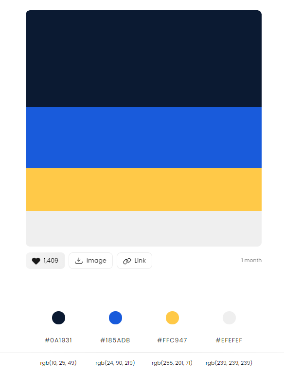

# 🔗 Vue.js 미니 프로젝트

### 프로젝트 개요

-   프로젝트 과정 : 2021 혁신성장 청년인재 양성사업, 블록체인을 활용한 비즈니스 모델 개발
-   프로젝트 명 : 강사의 품격(Course Evaluation System)
-   프로젝트 기간 : 21.07.09 ~ 21.07.22

### 프로젝트 설명

1. 서비스 설명 : 신뢰를 기반한 블록체인 시스템을 활용하여 각 교육기관(정부산하교육센터/대학/사교육기관 등)의 수강생들이 실시하게 되는 강의평가결과를 조작 위험없이 저장 및 관리하기 위한 투명성 있는 강사 선정 및 평가 시스템

2. 현황(문제점)

    - 교육기관들이 지인 및 친분관계를 바탕으로 실력이 없는 특정 강사에게 특혜를 주는 경우가 있음
    - 조작된 강의 평가 결과를 참고한 새로운 수강생들의 피해 사례
    - 교육기관을 감독해야하는 주체들이 교육기관들이 자체로 실시한 강의평가를 더이상 신뢰하지 않고 있음

3. 블록체인 기술을 통해 해결하고자 하는 과제 : 강의 혹은 강사들에 대한 평가결과들이 기술적으로 조작이 가능하기 때문에 그에 대한 신뢰도가 많이 떨어져있다. 신뢰성 높은 평가결과를 제공하게 된다면 특정강사 특혜 논란, 허위 평가로 인한 수강생들의 피해 등을 해결할 수 있고 투명한 강사 선정 기준을 제공해 줄수 있다.

---

### 프로젝트 세부 수행과정

##### 21.07.02 ~ 21.07.09

<a href ='./presentaion/강사의_품격-아이디에이션.pdf'>1. 강사의 품격, 아이디에이션</a>
<a href ='./presentaion/강사의_품격-벤치마킹조사.pdf'>2. 강사의 품격, 벤치마킹 조사</a>
<a href ='./presentaion/강사의_품격-벤치마킹.pdf'>3. 강사의 품격, 벤치마킹</a>
<a href ='./presentaion/강사의_품격-와이어프레임.pdf'>4. 강사의 품격, 와이어프레임</a>

##### 21.07.12 - 21.07.22

개발시작

### 참고자료

-   bootstrap template : startbootstrap-admin-page
    (https://github.com/StartBootstrap/startbootstrap-sb-admin-2)

-   fontawesome : vue-fontawesome
    (https://github.com/FortAwesome/vue-fontawesome)

-   로그인 페이지 그라데이션 bg-color : https://webgradients.com/

-   color theme(https://colorhunt.co/)

</img>

